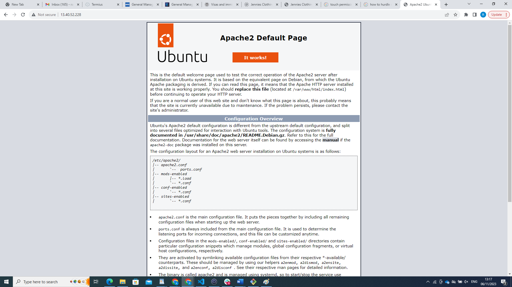

# LAMP STACK Implementation #
## Before performing the implementation below I already done the followings: ##

Registered an account with AWS Cloud Provider

Created a Free EC2 Instance (with Ubuntu Linux OS option)

I have downloaded keypair.pem 

setup security group that use to connect server remotely through ssh (port 22)

## connect remotely to the Ec2 instance using Git Bash terminal ##

## update the server using `sudo apt update command` ##

## installing Apache Server using `sudo apt install apache2` ##

Apache was installed on the EC2 instance. behold pictures below.

## Verifying that Apache2 is running using the `sudo systemctl status apache2` command ##

## An attempt to run apache server locally in the ubuntu shell using `curl http://localhost:80` or curl `http://127.0.0.1:80`command

## copying the ec2 public ipaddress and pasting it on the browser address bar displays the image below: ##

## Installing Mysql-server on the EC2 machine using the command `sudo apt install myql-server `##

mysql-server is now installed for database services.

## logged into Mysql using `sudo mysql` command ##

## Installing Php: ##
Using `sudo apt install php`

## configuring php to handle php files ##
using `sudo apt install libapache2-mod-php` command

## establishing communication between php and mysql ##
using `sudo apt install php-mysql` command

## trying to create a Virtual Host for the Website using Apache ## 
creating a directory called `projectlamp` by using the `mkdir` command in 
`sudo mkdir /var/www/projectlamp` and changing the ownership by assigning ownership to `$USER`by using this command
`sudo chown -R $USER:$USER /var/www/projectlamp`
then open the configuration file in Apache named `sites-available` with this command `sudo vi /etc/apache2/sites-available/projectlamp.conf`

then inside the blank file that opens copy this code 
`<VirtualHost *:80>
    ServerName projectlamp
    ServerAlias www.projectlamp 
    ServerAdmin webmaster@localhost
    DocumentRoot /var/www/projectlamp
    ErrorLog ${APACHE_LOG_DIR}/error.log
    CustomLog ${APACHE_LOG_DIR}/access.log combined
</VirtualHost>`

## To display the php page we need to:
disable 000-default and enable projectlamp by the following commands: ##
  `sudo a2dissite 000-default`
  `sudo a2ensite projectlamp`
  `sudo apache2ctl configtest`
  `sudo systemctl reload apache2`

 

## To enable the PHP on the website we do the following:##
* give `index.php` the priority over `index.html`
using the following commands/codes.
`sudo vim /etc/apache2/mods-enabled/dir.conf`
`<IfModule mod_dir.c>
        #Change this:
        #DirectoryIndex index.html index.cgi index.pl index.php index.xhtml index.htm
        #To this:
        `DirectoryIndex index.php index.html index.cgi index.pl index.xhtml index.htm`
</IfModule>`

then create index.php in the projectlamp using:  
`sudo vim /var/www/projectlamp/index.php`

then insert this code into index.php file

` <?php
phpinfo();`

refresh on the broswer address bar with the public IP of the instance to display the php page below

To disable this page use `rm`command in 
`sudo rm /var/www/projectlamp/index.php`

then refresh again to have. 

thank you 

 