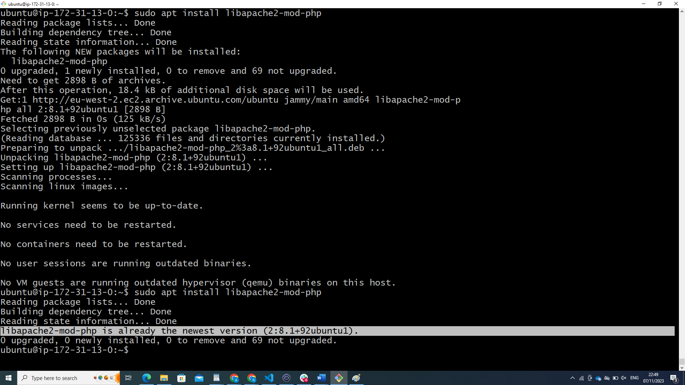

# LAMP STACK Implementation #
## Before performing the implementation below I already done the followings: ##

Registered an account with AWS Cloud Provider

Created a Free EC2 Instance (with Ubuntu Linux OS option)

I have downloaded keypair.pem 

setup security group that use to connect server remotely through ssh (port 22)

## connect remotely to the Ec2 instance using Git Bash terminal ##

## update the server using `sudo apt update command` ##

## installing Apache Server using `sudo apt install apache2` ##

Apache was installed on the EC2 instance. behold pictures below.

## Verifying that Apache2 is running using the `sudo systemctl status apache2` command ##

## An attempt to run apache server locally in the ubuntu shell using `curl http://localhost:80` or curl `http://127.0.0.1:80`command

## copying the ec2 public ipaddress and pasting it on the browser address bar displays the image below: ##

## Installing Mysql-server on the EC2 machine using the command `sudo apt install myql-server `##

mysql-server is now installed for database services.

## logged into Mysql using `sudo mysql` command ##

## Installing Php: ##
Using `sudo apt install php`

## configuring php to handle php files ##
using `sudo apt install libapache2-mod-php` command

## establishing communication between php and mysql ##
using `sudo apt install php-mysql` command

<?php
phpinfo();
 