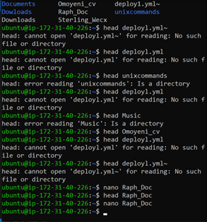
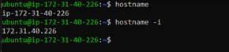

# Linux Commands Project 1

## `sudo apt upgrade`

## `pwd` 
display the current directory

## `cd`
for navigating through directories and subdirectory

## `ls` -R, -a, -lh
use to list all files and directory

## `Cat and Tac` 
used to merge files and view the content of files.txt

## `cp` 
used to copy file and folder from one location to another in duplicates

## `mv`
used to move file or directory location and also used to rename files or directories

## `mkdir`
used to make directory and sub-directories

## `rmdir`
used to remove directories permanently

## `rm`
used to remove files singlarly or collectively 

## `touch`
used to create files

## `locate`
used to find files and directories location

## `Find`
used to locate files and directories

## `grep`
used search for specific words in a file.

## `df -h`
used to view harddick space of a system in human redable form

## `du -s -h`
used to check file or directory size on the disk space.

## `Head and Tail` 
displays the first 10 lines and the last 10 lines of the contents of a file
but it is working here because the created files are empty

## `diff` 
shows the difference in a file comparism with another file 

## `tar`
used to archive files and folders: however is not working as supposed.

## `chmod`
used to determine the access level of modification to a file or directory

## `Chown`
used to change ownership but i wish i could demonstrate better than this picture below.

## `jobs`
this command is only available in csh, bash, tcsh, and ksh shells.

## `kill`
this used to stop an unwanted operation by using the PID number

PID Number is dispLayed by `ps ux`

## `ping`
used to test connection within the network devices

## `wget`
used to download files from internet.

## `uname`
used to find out details about the Linux machine and the hardware you are running

## `top`
used to diplay all the running process of the server

## `History`
used to display all issued commands before

## `man`
used to display user manual of any commands

## `zip`
used to archieve files and directories

## `hostname`
used to display the fullname or IP address of the machine.

## `useradd`
used to create a new user account but only with root privilege mode.

## `apt-get`
this command gives access to the Linux Libraries command line Advanced Package Tool (APT) tool.

## `nano, vi, jed` 
used to manage edit file content through a text editor.
sample of text editor environment of a file.

## `Alias, Unalias`
used to rename or unmane file name or commands in order to create shortcut of same funtionality. 

## `su`
used to switch user while allowing programs to run on different users
samples of options with su commands

## `htop`
displays an interactive program to monitor system resources and server processes in real time. 

## `ps`
used to monitor process status of all running processes in your system.

