# Project 2 on GIT
## Initialiation of a Git Repository 
uisng `mkdir cd and git init` command
Git_Repo and Git-Class were Initiatized 

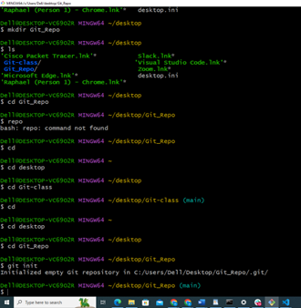

## exposing .git folder in the repository
.git is responsible for the versioning services which is created by `git init` command
a view of the content in the .git folder

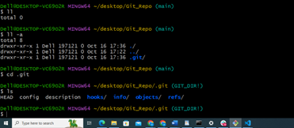

## creating file in our repo and add codes in it.
using `touch and nano` command

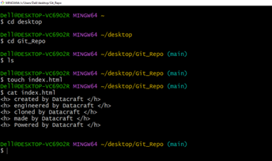

## moving the file to the staging area 
 using the `git add` command

 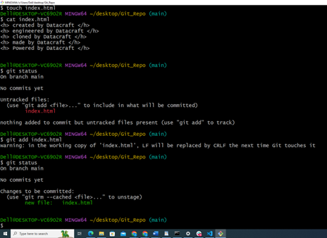

 ## the git work flow displayed 
 using history `command`

 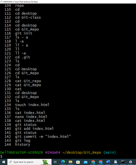

 ## securing information on git 
 through `.gitignore` folder creation

 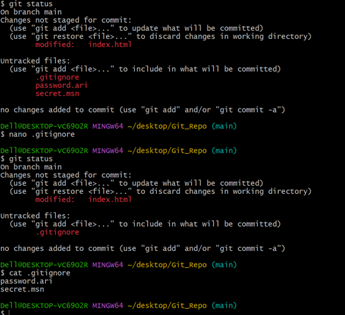

 ## creating a new repository on github

 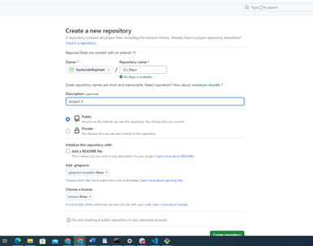

 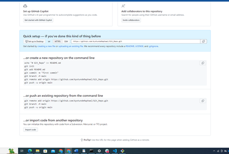 

 ## pushing content from local host to the gitcentral repository
 using `git remote add origin https://github.com/AyotundeRaphael/Git_Repo.git`
`git branch -M main`
`git push -u origin main`

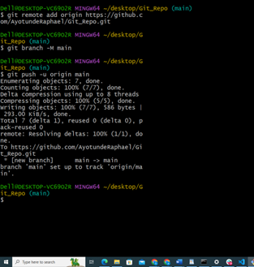

## Pulling content from the Git central repository to the local host
using `git clone `command

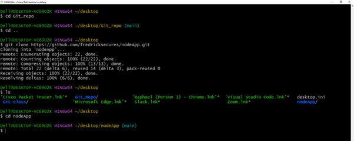

## Creating Branches 
using `git branch` command

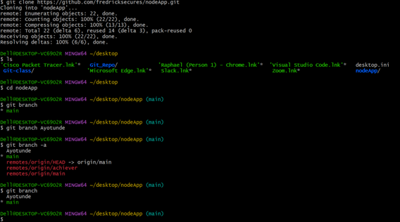

## switching branch and displaying the content of the branch to confirm same as main
using `git switch` and `git checkout` command.

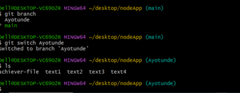

## updating branch and pushing the branch to the Github central repository
using the `git remote -v` and `git push origin`

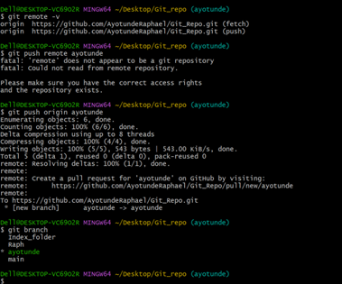

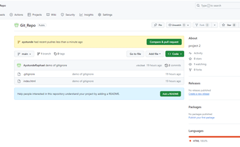

## working through the Github GUI to merge and to confirm the created branch.
Merging and confirmation

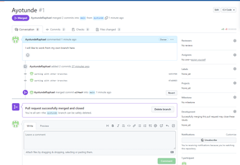

Ayotunde is now a Branch.

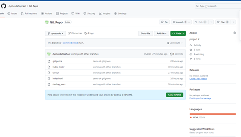

# Thank You. 
